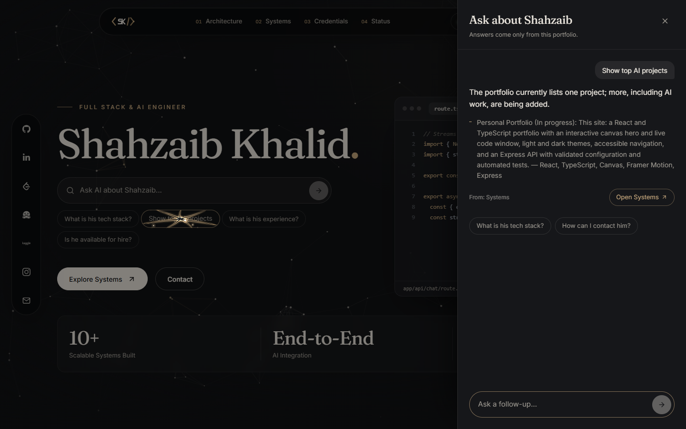

# Shahzaib Khalid — Personal Portfolio

A full-width portfolio for a Full Stack & AI Engineer, built with React and TypeScript, with an interactive particle hero, a fluid cursor trail, and a running Express API foundation.

## Current features

- Full browser-width layout with responsive navigation and a mobile menu
- Original interlocking SK logo and matching adaptive favicon
- Light/dark themes with saved preferences and system-theme support
- Locally served Inter and Fraunces fonts and a calm slate/sage palette
- An ultra-dark hero with an interactive canvas particle network that parts around the cursor
- A liquid "symbiote" cursor: a spring-driven nucleus with cyan-to-violet tendrils that grab nearby buttons and cards, pour their glow into them, pull them magnetically, and burst on click
- Framer Motion entrance animation, a gradient sheen on the name, a live "Available for Work" badge, and glass buttons
- About with an Experience timeline and "The layers I work across" — Interface, Intelligence, Services, and Data, with a signal that travels down the stack
- A Skills page with a black hole whose accretion disk pulls every skill logo into orbit
- Pause controls, offscreen and hidden-tab pausing, and full reduced-motion and touch fallbacks
- Full About, Skills, Projects, Blog, and Contact sections driven by editable config files
- A contact form that opens the visitor's email app once your address is configured
- Express health API, validated environment settings, Helmet, exact-origin CORS, and consistent errors
- Strict TypeScript, ESLint, Prettier, Vitest/Supertest API tests, and browser checks

**Project status:** the site foundation, interactive hero, API foundation, and all five content sections are implemented. PostgreSQL persistence, server-side contact email, Hashnode/GitHub integrations, and the admin dashboard remain in the planned phases. Unconfigured personal details stay hidden or inactive rather than being invented.

## Screenshots



[Skills black hole](docs/screenshots/skills-black-hole.png)

## Run locally

Use Node.js 24 and npm 10 or newer. From the root:

```sh
npm install
npm run dev
```

- Portfolio: **http://127.0.0.1:5173**
- Backend health: **http://127.0.0.1:3001/api/health**
- Proxied health: **http://127.0.0.1:5173/api/health**

The startup command checks both services. It reuses existing portfolio servers, starts missing ones, and refuses to take over a port belonging to a different application. Ctrl+C stops only the processes it started.

To run one service independently:

```sh
npm run dev:client
npm run dev:server
```

No database credentials are required for the current health API. A health response with `status: "ok"` means the Express service is running. The separate `database` field reports that PostgreSQL is not connected yet.

## Hero and interactive effects

| Piece              | File                                                        | Notes                                                                                                                                                                                                                                  |
| ------------------ | ----------------------------------------------------------- | -------------------------------------------------------------------------------------------------------------------------------------------------------------------------------------------------------------------------------------- |
| Hero layout        | `client/src/components/hero/Hero.tsx`                       | Command HUD: word cycler, glass name plate, terminal status block, stack pills, CTAs, metrics; text lives in `heroHud` / `heroMetrics` in `config/content.ts`                                                                          |
| Code window        | `client/src/components/hero/CodeWindow.tsx`                 | Types the active file with syntax colouring; each stack pill opens its file from `hero/codeSamples.ts`                                                                                                                                 |
| Social dock        | `client/src/components/SocialDock.tsx`                      | Fixed left glass dock (1280 px and wider) for GitHub, LinkedIn, Email, X, and Resume; unconfigured links show as "soon"                                                                                                                |
| Section overlays   | `client/src/components/SectionOverlay.tsx`                  | The home page never scrolls; `/#about`, `/#projects`, `/#credentials`, `/#status`, and `/#contact` open full-screen panels (Escape or Back closes)                                                                                     |
| Ask bar and drawer | `client/src/components/hero/AskBar.tsx`, `AnswerDrawer.tsx` | Search field and prompt chips; answers slide in with sources and a link to the relevant section                                                                                                                                        |
| Chatbot            | `client/src/lib/chatbot/`                                   | Intent model trained in the browser on ~30 topics (TF-IDF words + character trigrams, typo-tolerant), skill lookup, follow-up memory; answers only from `config/`. Add phrasings in `intents.ts`; `npm test` reports held-out accuracy |
| Navbar             | `client/src/components/Navbar.tsx`                          | Fixed floating glass pill with gradient hover underlines and the `<SK />` logo                                                                                                                                                         |
| Particle network   | `client/src/components/effects/ParticleField.tsx`           | Canvas 2D, about 1 particle per 9,500 px² (max 150); pushed away from the trail head, then damped                                                                                                                                      |
| Symbiote cursor    | `client/src/components/effects/VenomCursor.tsx`             | Spring nucleus with 7 tendrils; within 60 px of a `data-symbiote-target` they grab its border, buttons absorb the nucleus and glow, clicks burst                                                                                       |
| Black hole         | `client/src/components/skills/BlackHole.tsx`                | CSS horizon, lensing ring, and accretion disk; skill logos follow decaying Kepler orbits and respawn at the edge                                                                                                                       |
| Page themes        | `client/src/components/themes/`                             | One backdrop per overlay, chosen in `SectionOverlay.tsx`: pyramids (Architecture), space (Skills), Mars colony with a ringed planet, labelled as the system architecture (Systems), dimension shift (Credentials), desert (Status)     |
| Layers pyramid     | `client/src/components/sections/WorkLayers.tsx`             | Interactive pyramid from `workLayers`: Data at the base, Interface at the apex, Delivery as the platform                                                                                                                               |
| Shared pointer     | `client/src/lib/pointer.ts`                                 | One passive listener feeds both canvases                                                                                                                                                                                               |

Both canvases cap the pixel ratio at 2 and draw in a single `requestAnimationFrame` loop. The particle field pauses when offscreen or in a hidden tab. To make any element grabbable, add `data-symbiote-target` (or `data-symbiote-target="card"` for a large surface: gentler pull, no absorption). The glow comes from the `[data-symbiote-target]` rules in `globals.css`, and Tailwind's `symbiote:` variant styles an element while it is held, for example `className="symbiote:text-white"`. The cursor runs only for a mouse or pen, and the trail, black hole, and particle motion are all off under reduced motion; Framer Motion follows the same setting through `MotionConfig`.

## Commands and verification

| Command                      | Purpose                                                                   |
| ---------------------------- | ------------------------------------------------------------------------- |
| `npm run dev`                | Start or reuse the frontend and API                                       |
| `npm run lint`               | Check code conventions                                                    |
| `npm run typecheck`          | Check both workspaces, including API tests                                |
| `npm run format`             | Format source and documentation                                           |
| `npm run format:check`       | Check formatting                                                          |
| `npm test`                   | Run eight API behavior tests                                              |
| `npm run build`              | Build the client and server                                               |
| `npm run check`              | Run lint, types, formatting, tests, and builds                            |
| `npm run preview`            | Preview the built client on port 4173                                     |
| `npm run check:browser`      | Check navigation/theme behavior against a temporary production preview    |
| `npm run check:enhancements` | Check the hero, chatbot, overlays, skills page, and live API connectivity |

For browser checks, install Chromium once:

```sh
npx playwright install chromium
```

Then run:

```sh
npm run check
npm run check:browser
```

Keep `npm run dev` running in another terminal for `npm run check:enhancements`. Its defaults are ports 5173 and 3001. Override them with `PORTFOLIO_TEST_URL` and `PORTFOLIO_API_URL` if needed.

You can use an installed Chrome instead of downloading Chromium. In PowerShell:

```powershell
$env:PORTFOLIO_BROWSER_CHANNEL = 'chrome'
npm run check:browser
npm run check:enhancements
```

Generated screenshots are saved to `.artifacts/`. Selected versions are copied into `docs/screenshots/`.

## Personal content

Edit **`client/src/config/site.ts`** for your name, title, tagline, bio, email, location, university, company, account URLs, and resume settings.

Edit **`client/src/config/content.ts`** for the About paragraphs and focus list, skill groups, projects, and blog posts.

- Replace bracketed profile values to activate the corresponding links.
- Add `client/public/resume.pdf`, then set `resume.available` to `true`.
- Placeholder links remain inactive until configured; no profile data is invented.
- Bracketed values in either file are hidden on the page (About facts, project links) until replaced.
- The contact form stays disabled until `site.email` holds a real address.

The light/dark palette is defined in `client/src/styles/globals.css` and mapped to Tailwind classes in `client/tailwind.config.ts`.

## Architecture and stack

```text
Browser
  └─ React 18 + TypeScript + Vite
       ├─ Tailwind CSS 3, React Router, Inter/Fraunces
       ├─ Canvas 2D particle field + cursor trail, Framer Motion
       └─ /api proxy during local development
            └─ Express 5 + TypeScript
                 ├─ /api/health
                 ├─ Zod configuration + Helmet + CORS + JSON errors
                 └─ PostgreSQL integration (planned)
```

The `client/` workspace owns presentation. The `server/` workspace owns API behavior and server-only configuration. The API factory is separated from the listening process so tests can exercise routes without occupying the development port.

## Environment variables

Defaults work without creating environment files. See the examples in each workspace.

| Variable          | Location | Default / purpose                                       |
| ----------------- | -------- | ------------------------------------------------------- |
| `VITE_API_URL`    | Client   | `/api`; public API base URL for upcoming data features  |
| `PORT`            | Server   | `3001`                                                  |
| `HOST`            | Server   | `127.0.0.1`; use `0.0.0.0` on a hosted deployment       |
| `NODE_ENV`        | Server   | `development`                                           |
| `FRONTEND_ORIGIN` | Server   | `http://127.0.0.1:5173`; exact permitted browser origin |
| `DATABASE_URL`    | Server   | Empty; reserved for the PostgreSQL phase                |

The API loads `server/.env` relative to its own files. Real environment files are ignored by Git. Never put passwords, tokens, or other secrets in `VITE_` variables. Changing server connection settings requires restarting the development command.

## Roadmap and guides

The initial eight-phase plan still governs the remaining work. The logo, hero scene, full-width layout, and running API foundation were brought forward at your request.

- [Phase 1 file guide](docs/phase-1.md) — historical foundation handoff.
- [Layout and API update](docs/wolf-and-api.md) — historical notes from the earlier wolf hero and API foundation.
- [Backend instructions](server/README.md).

Next phases complete the static content, PostgreSQL migrations and public data APIs, contact workflow, cached profile/blog integrations, authenticated administration, and release checks.

## Deployment

- **Source:** https://github.com/shahzaibeng/Shahzaib-Khalid
- **Vercel:** `vercel.json` installs with `npm ci`, builds only the client (`npm run build --workspace @portfolio/client`), serves `client/dist/`, and rewrites unknown paths to `index.html` for client-side routing. Hashed assets are cached for a year.
- The site is fully static: the chatbot runs in the browser and the contact form uses the visitor's email app, so no server is needed in production. The Express API (`server/`) can be hosted separately on Render or Railway later with `HOST=0.0.0.0` and `FRONTEND_ORIGIN` set to the Vercel URL.

### Contact email (Resend)

The contact form posts to `/api/contact`. On Vercel that is `client/api/contact.ts`; locally the Express API serves the same route. To turn on delivery:

1. Create a free account at https://resend.com with **shahzaibkhalid.eng@gmail.com** and create an API key.
2. In Vercel → Project → Settings → Environment Variables, add `RESEND_API_KEY` (and optionally `CONTACT_TO`), then redeploy.
3. For local testing, put the same key in `server/.env`.

Without a key, the form explains that sending isn't available and offers the visitor's email app instead. Resend's test sender (`onboarding@resend.dev`) only delivers to the Resend account's own address; verify a domain in Resend and set `CONTACT_FROM` to send from your own domain.

## References

- [Vite setup](https://vite.dev/guide/)
- [Tailwind CSS 3 with Vite](https://v3.tailwindcss.com/docs/guides/vite)
